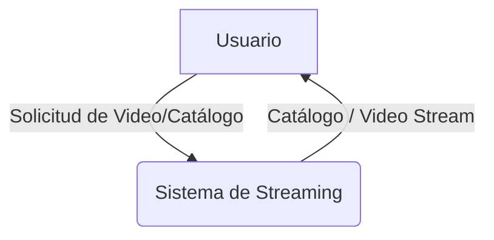
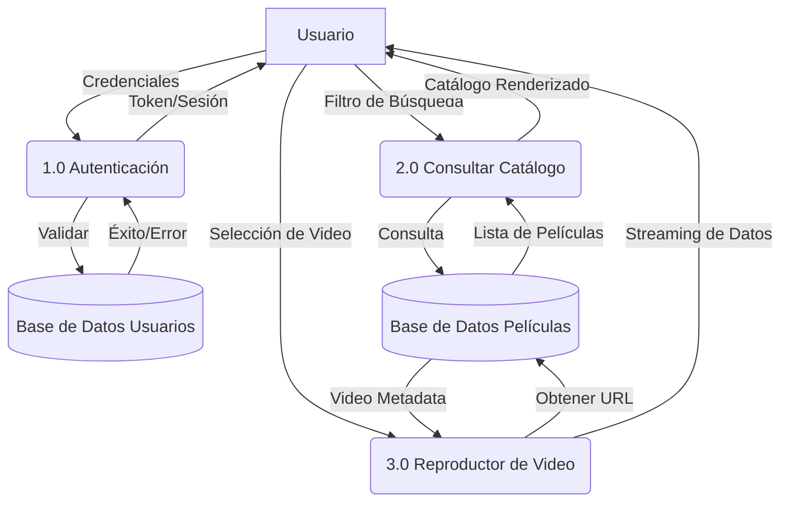

# Guía de Diagramas de Flujo de Datos (DFD)

Los **Diagramas de Flujo de Datos (DFD)** muestran cómo fluye la información a través de un sistema de información. Se organizan por niveles para pasar de una visión global a una detallada.

## 1. Niveles del DFD

### 1.1. Nivel 0: Diagrama de Contexto
Es el nivel más alto. Representa el sistema como una "caja negra" única y sus interacciones con entidades externas.

---

### 1.2. Nivel 1: Diagrama de Detalle de Procesos
En este nivel, la "caja negra" se abre para mostrar los procesos principales, almacenes de datos y cómo fluye la información entre ellos.

---

## 2. Componentes de un DFD

- **Procesos (Círculos/Rectángulos redondeados)**: Transforman las entradas en salidas (ej. "Validar Usuario").
- **Flujos de Datos (Flechas)**: Representan el paquete de información en movimiento.
- **Almacenes de Datos (Líneas paralelas / Cilindros)**: Donde la información reside en reposo (ej. tablas SQL).
- **Entidades Externas (Rectángulos)**: Orígenes o destinos de los datos fuera del control del sistema (ej. El Usuario).

## 3. Relación con nuestro Código Flask

| Elemento DFD | Implementación en el Proyecto |
| :--- | :--- |
| **Proceso 2.0 (Catálogo)** | Función `catalogo()` en `app.py`. |
| **Almacén DB2 (Películas)** | Lista `VIDEOS` en `app.py` (futura tabla SQL). |
| **Flujo "Solicitud"** | Ruta HTTP de Flask (ej. `/catalogo`). |
| **Flujo "Catálogo Renderizado"** | Template `catalogo.html` procesado por Jinja2. |

---
**[Volver al README principal](README.md)**
