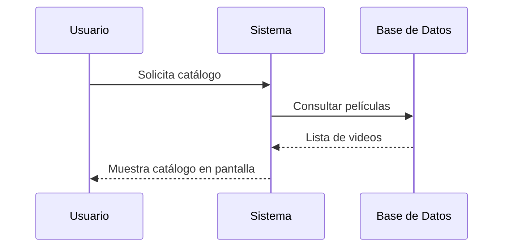
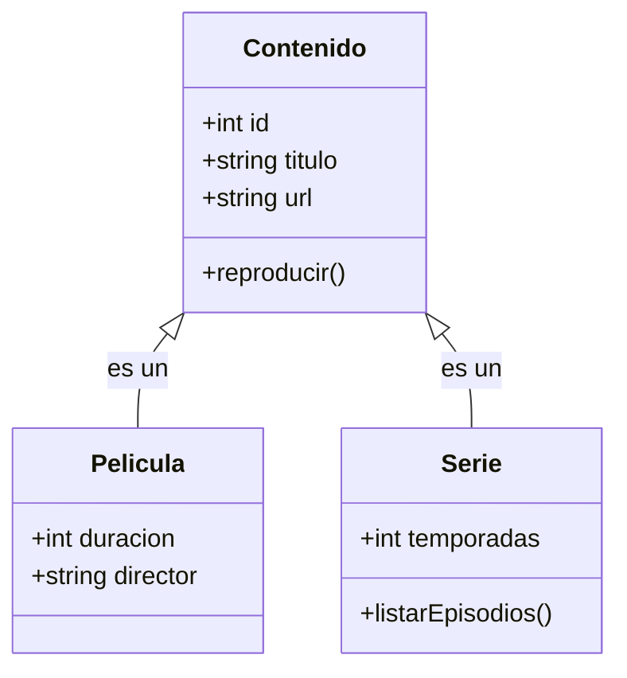

# Guía Detallada de UML - Ingeniería de Software

El **Lenguaje Unificado de Modelado (UML)** es el estándar de la industria para visualizar, especificar, construir y documentar los artefactos de un sistema de software.

## 1. Conceptos Fundamentales

### 1.1. Actores
Un **Actor** representa un rol desempeñado por un usuario humano, un dispositivo de hardware u otro sistema que interactúa con el nuestro.
- **Primarios**: Iniciarán un caso de uso (ej. Usuario Final).
- **Secundarios**: Proporcionarán un servicio al sistema (ej. Pasarela de Pagos, Servidor de Correo).

### 1.2. Casos de Uso
Representan las funcionalidades del sistema desde la perspectiva del usuario. Describe "qué" hace el sistema, no "cómo".

---

## 2. Diagramas de Comportamiento

### 2.1. Diagrama de Casos de Uso
Ideal para definir el alcance del sistema.

```mermaid
useCaseDiagram
    actor "Usuario" as U
    actor "Administrador" as A
    package "Sistema de Streaming" {
        usecase "Buscar Película" as UC1
        usecase "Ver Video" as UC2
        usecase "Gestionar Catálogo" as UC3
        usecase "Iniciar Sesión" as UC4
    }
    U --> UC1
    U --> UC2
    U --> UC4
    A --> UC3
    A --> UC4
```

### 2.2. Diagrama de Secuencia
Muestra la interacción entre objetos en un orden temporal.



---

## 3. Diagramas Estructurales

### 3.1. Diagrama de Clases (Detallado)
Define la estructura del sistema mediante clases, atributos y métodos, además de las relaciones entre ellos.

- **Herencia**: Un objeto "es un" tipo de otro.
- **Asociación**: Relación general entre clases.
- **Agregación/Composición**: Relaciones de "parte de".



---

## 4. Importancia de UML en el Proyecto
Modelar antes de codificar nos permite:
1. **Detectar errores de lógica** antes de escribir código.
2. **Facilitar la comunicación** entre desarrolladores y stakeholders.
3. **Escalabilidad**: Es más fácil planificar nuevas funciones (como suscripciones o perfiles) si la estructura base está clara.

[Volver al README principal](README.md)
