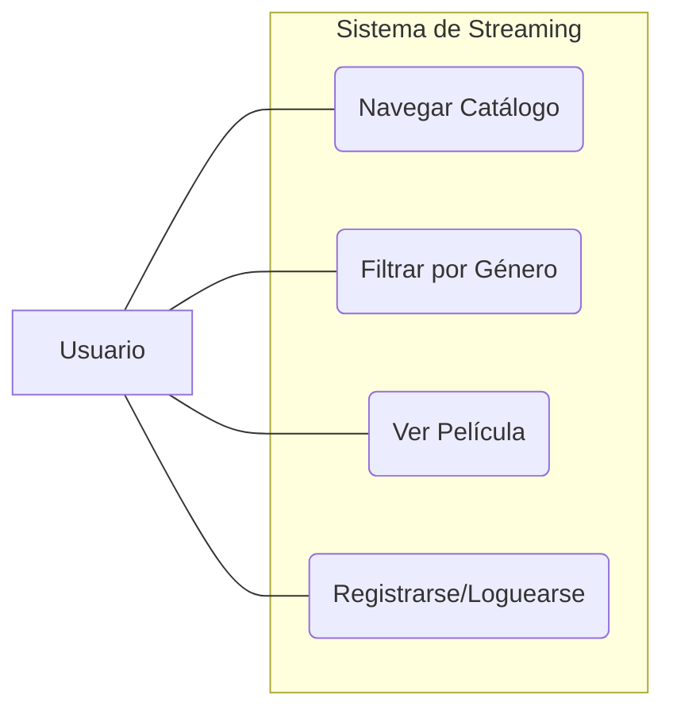
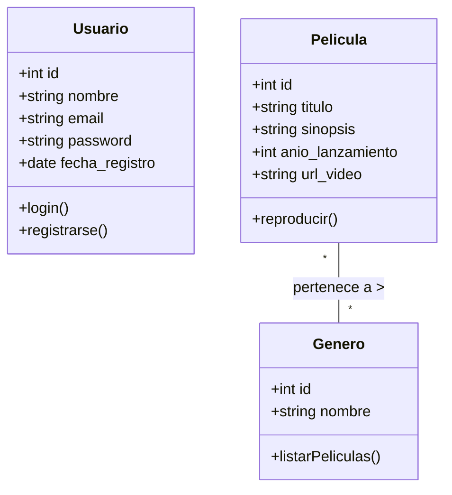

# Guía Detallada de UML - Ingeniería de Software

El **Lenguaje Unificado de Modelado (UML)** nos permite documentar la estructura y comportamiento de nuestro sistema StreamFlow.

## 1. Conceptos Fundamentales
... (conceptos de actores y casos de uso se mantienen) ...

---

## 2. Diagramas de Comportamiento

### 2.1. Diagramas de Casos de Uso y Secuencia
*(Actualizados según el sistema de Usuarios y Películas)*

---

## 3. Diagramas Estructurales

### 3.1. Diagrama de Clases (Sincronizado con el ER)
Este diagrama es el plano directo de nuestras clases en `app.py`.

**Nota Técnica:** La relación entre `Pelicula` y `Genero` es de **Muchos a Muchos**, lo que en base de datos se traduce en la tabla intermedia `pelicula_genero` que estamos utilizando.

---

## 4. Coherencia entre Modelos
Es vital que el alumno entienda que:
1. Las **Entidades** del Diagrama ER se convierten en **Clases** en UML.
2. Los **Atributos** del ER se convierten en **Variables de Clase**.
3. Las **Relaciones** del ER definen cómo interactúan los objetos en el código.

[Volver al README principal](README.md)

