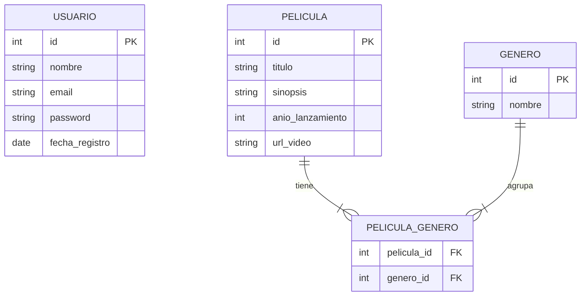
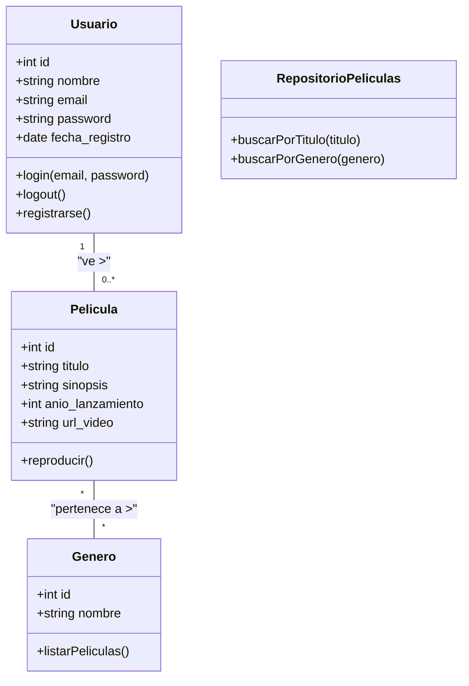

# Proyecto de Streaming - Ingeniería de Software Aplicada

Este proyecto ha sido diseñado como una introducción práctica a los conceptos de la Ingeniería de Software, sirviendo como puente hacia el desarrollo de software con tecnologías como Python y Flask.

El objetivo es modelar un sistema de streaming de video simple, aplicando diagramas y técnicas de análisis y diseño antes de escribir una sola línea de código.

## 1. Conceptos Fundamentales de Modelado

En la ingeniería de software, los modelos nos permiten visualizar, entender y comunicar la estructura y el comportamiento de un sistema antes de su construcción. A continuación, se describen tres de las herramientas de modelado más importantes.

### 1.1. Diagramas de Flujo de Datos (DFD)

Un **Diagrama de Flujo de Datos (DFD)** se centra en el flujo de la información a través de un sistema. Muestra de dónde vienen los datos, a dónde van, y cómo se procesan y almacenan.

> [!TIP]
> **[👉 Guía Detallada de DFD: Nivel 0 (Contexto) y Nivel 1 (Procesos)](DOCUMENTACION_DFD.md)**

**Componentes Principales:**
*   **Entidades Externas:** Actores que interactúan con el sistema enviando o recibiendo datos (ej. un Usuario).
*   **Procesos:** Actividades que transforman los datos (ej. "Buscar Película").
*   **Almacenes de Datos:** Lugares donde se guardan los datos (ej. una tabla de "Películas" en una base de datos).
*   **Flujos de Datos:** Flechas que indican el movimiento de los datos entre los otros tres componentes.

### 1.2. Lenguaje Unificado de Modelado (UML)

El **Lenguaje Unificado de Modelado (UML)** es un estándar para el modelado de sistemas de software que abarca mucho más que solo el flujo de datos. Proporciona una serie de diagramas para describir el sistema desde diferentes perspectivas (estructural y de comportamiento).

> [!TIP]
> **[👉 Ampliar conceptos de UML (Actores, Procesos y Diagramas)](DOCUMENTACION_UML.md)**

**Diagramas Clave:**
*   **Diagrama de Casos de Uso:** Describe la funcionalidad del sistema desde el punto de vista del usuario (actor). Responde a la pregunta: ¿qué puede hacer el sistema?
*   **Diagrama de Clases:** Muestra la estructura estática del sistema: sus clases, atributos, métodos y las relaciones entre ellas. Es el plano de la arquitectura del código.
*   **Diagrama de Secuencia:** Muestra cómo los objetos interactúan entre sí a lo largo del tiempo para realizar una tarea específica. Es ideal para detallar la lógica de un caso de uso.

### 1.3. Modelo Entidad-Relación (MER / ERD)

El **Modelo Entidad-Relación (MER o ERD por sus siglas en inglés)** es un tipo de diagrama de flujo que ilustra cómo las "entidades", como personas, objetos o conceptos, se relacionan entre sí dentro de un sistema. Se utiliza principalmente para el diseño de bases de datos.

> [!TIP]
> **[👉 Guía de Diseño de BD: Normalización (1NF, 2NF, 3NF) y Conceptos Clave](DOCUMENTACION_BD.md)**

**Componentes Principales:**
*   **Entidades:** Representan objetos del mundo real sobre los que queremos almacenar información (ej. `Usuario`, `Pelicula`).
*   **Atributos:** Las propiedades o características de una entidad (ej. el `nombre` de un `Usuario`).
*   **Relaciones:** Describen cómo dos o más entidades están conectadas (ej. un `Usuario` *ve* una `Pelicula`).

## 2. Relaciones y Coincidencias entre Modelos

Estos diagramas no son islas separadas; se complementan para ofrecer una visión completa del sistema:

*   **DFD y UML:** Un DFD puede ser un excelente punto de partida. Las "entidades externas" del DFD a menudo se convierten en "actores" en los diagramas de Casos de Uso de UML. Los "procesos" y "almacenes de datos" del DFD nos dan pistas para identificar las clases y métodos en un Diagrama de Clases.
*   **MER y UML:** Un Diagrama de Clases de UML y un MER son muy similares, pero tienen un enfoque diferente. El MER se centra exclusivamente en la estructura de los datos (perfecto para diseñar el esquema de una base de datos), mientras que un Diagrama de Clases también modela el *comportamiento* (los métodos o funciones de la clase). Las "entidades" del MER se corresponden directamente con las "clases" en UML.
*   **DFD y MER:** Los "almacenes de datos" en un DFD casi siempre se corresponden con las "entidades" en un MER. Si tu DFD muestra que necesitas almacenar información sobre "Películas", entonces necesitarás una entidad "Pelicula" en tu MER.

## 3. Modelado del Proyecto de Streaming

Apliquemos estos conceptos a nuestro sistema básico de streaming.

### 3.1. Descripción del Sistema

El sistema permitirá a los usuarios ver un catálogo de películas. Las películas estarán organizadas por género. Un usuario puede registrarse y acceder al sistema para navegar y ver el contenido.

### 3.2. Modelo Entidad-Relación (MER / ERD)

Este diagrama define la estructura de nuestra base de datos.

**Explicación:**
*   Tenemos tres entidades principales: `USUARIO`, `PELICULA` y `GENERO`.
*   Una película puede tener varios géneros, y un género puede agrupar varias películas. Para modelar esta relación de **muchos a muchos**, usamos una tabla intermedia (o entidad de enlace) llamada `PELICULA_GENERO`.

### 3.3. Diagrama de Clases (UML)

Este diagrama representa cómo organizaríamos nuestro código. Es similar al MER, pero podemos añadir métodos (comportamiento).

**Explicación:**
*   Las clases `Usuario`, `Pelicula` y `Genero` reflejan nuestras entidades.
*   Hemos añadido métodos que definen lo que cada objeto puede hacer, como `login()` en `Usuario` o `reproducir()` en `Pelicula`.
*   La clase `RepositorioPeliculas` es un ejemplo de un patrón de diseño que se encarga de la lógica de acceso a los datos de las películas.

---

---

## 🛠️ Fase de Desarrollo e Implementación

Una vez completado el diseño de ingeniería, procedemos a la construcción del software utilizando **Python** y el framework **Flask**.

### 1. Configuración del Entorno
Para asegurar que el proyecto sea reproducible, utilizamos un **Entorno Virtual (VENV)**. Esto aísla nuestras dependencias y evita conflictos con el sistema.

> [!IMPORTANT]
> Puedes consultar los pasos detallados de instalación aquí:
> 👉 **[Guía de Inicio: Entorno Virtual y Flask](GUIA_INICIO.md)**

### 2. De los Modelos al Código
La implementación actual refleja el diseño UML y MER:
*   Las **clases** y **entidades** se gestionan en las rutas de Flask.
*   El **flujo de datos** se visualiza a través de las plantillas HTML en `/templates`.
*   El **catálogo** dinámico consume datos estructurados similares a los definidos en el MER.

### 3. Ejecución del Proyecto
Para ver la aplicación en funcionamiento:
1. Activa tu entorno virtual.
2. Ejecuta `python app.py`.
3. Abre tu navegador en `http://127.0.0.1:5000`.

---
© 2026 - Proyecto de Ingeniería y Desarrollo Web
